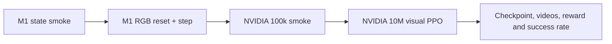
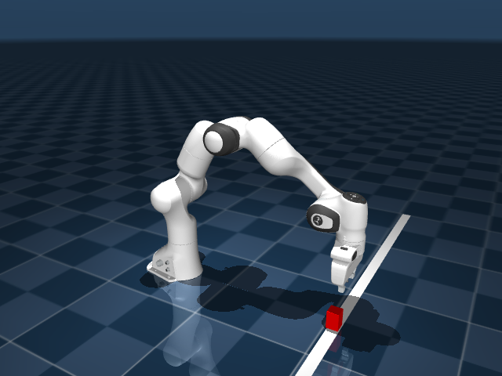

# Panda Vision PPO Reproduction

[](https://github.com/google-deepmind/mujoco_playground)


A reproducible engineering project for the MuJoCo Playground
`PandaPickCubeCartesian` visual pick-and-place task. It pins the upstream
source, validates state and pixel observations on Apple Silicon, checks the
Brax PPO training stack, and provides scripts for the official NVIDIA GPU
training configuration.

> This repository reports completed and pending stages separately. Local
> environment validation, 100k/10M visual PPO, fine-tuning, independent
> evaluation, robustness training, and guide-free trajectory diagnosis are
> complete. The fixed 95% left-side gate remains unmet; the next proposed work
> is a separate reach-to-lift stability experiment.

[中文说明](#中文说明) · [逐步学习课程](docs/course/README.md) ·
[Detailed reproduction guide](reproduction/README.md) ·
[Current status](reproduction/STATUS.md)

## What is being reproduced?

The agent receives a single-camera `64 x 64 RGB` observation and controls a
Franka Emika Panda robot through a three-dimensional Cartesian action. The
objective is to grasp the red cube and lift it to a fixed target height.

| Component | Configuration |
| --- | --- |
| Environment | `PandaPickCubeCartesian` |
| Learning method | PPO reinforcement learning |
| Observation | One camera, `64 x 64 RGB` |
| Action | Cartesian `y`, `z`, and gripper command |
| Physics/rendering | MuJoCo MJX + MJWarp |
| Official full run | 10M steps, 1,024 envs, 128 eval envs |
| Upstream source | `4db186a5b53427c9d313b9c7200480144894ada1` |



## Visual evidence

| Native MuJoCo state render | Actual `64 x 64` policy observation |
| --- | --- |
|  |  |

Both images were generated by the pinned source and the recorded dependency
profile on a MacBook Air with an Apple M1 and 16 GB of memory.

## Verified results

| Check | Result |
| --- | --- |
| State environment load and JIT reset | Passed |
| Two zero-action state steps | Passed; finite observation and simulator state |
| Native 640 x 480 MuJoCo render | Passed |
| One-world MJWarp RGB reset and step | Passed; shape `[1, 64, 64, 3]` |
| Cached RGB reset / step time on M1 | 1.546 s / 2.025 s |
| Minimal 128-step Brax PPO update | Passed |
| Linux NVIDIA 100k visual smoke | Passed; artifacts in `reproduction/artifacts/panda-vision-smoke/` |
| Adaptive 10M visual PPO run | Completed on RTX 2080 Ti; best success 3/64 |
| Initial full-run replay videos | Completed; no visible successful lift |
| Best-checkpoint fine-tuning | Completed; final success 62/64 (96.875%) |
| Independent held-out evaluation | Historical 990/1,024; guide-state caveat documented |
| Position-stratified evaluation | Historical result identified a left-side weakness |
| Targeted robustness 100k smoke | Passed; checkpoint restore, updates, and 3 evaluations completed |
| Targeted robustness experiment | Guide-free left confirmation: 964/1,024; 95% gate missed by 9 |

Machine-readable evidence is committed in
[`macos-state-smoke.json`](reproduction/results/macos-state-smoke.json) and
[`macos-vision-probe.json`](reproduction/results/macos-vision-probe.json), and
[`linux-independent-evaluation.json`](reproduction/results/linux-independent-evaluation.json).
The follow-up spatial analysis is in
[`linux-position-stratified-analysis.json`](reproduction/results/linux-position-stratified-analysis.json).
The targeted-training pipeline check is in
[`linux-robustness-smoke.json`](reproduction/results/linux-robustness-smoke.json).
The final controlled comparison is in
[`linux-targeted-robustness-evaluation.json`](reproduction/results/linux-targeted-robustness-evaluation.json).
The trajectory-stage and evaluation-integrity finding is in
[`linux-trajectory-failure-analysis.json`](reproduction/results/linux-trajectory-failure-analysis.json).
The corrected guide-free left-side result is in
[`linux-guide-free-left-trajectory-analysis.json`](reproduction/results/linux-guide-free-left-trajectory-analysis.json).

The historical held-out evaluation used four seeds and 256 episodes per seed
and succeeded in 990 of 1,024 episodes (`96.68%`). Subsequent trajectory
instrumentation showed that the environment's 5% guide-state training aid was
also active during evaluation. Those results remain reproducible development
evidence, but guide-free schema-version-4 confirmation is required before they
are treated as formal acceptance. None of these simulation figures are evidence
of real-robot transfer.

The schema-version-4 guide-free left-side evaluation is complete: the targeted
checkpoint reached 964/1,024 (`94.14%`) with a worst-seed rate of `91.80%`.
It passed the seed safeguard but missed the fixed 95% aggregate gate by nine
successes. Trajectory classification attributes 55 of 60 failures to
`reached_no_lift`; the next experiment therefore targets post-contact lifting
stability rather than changing spatial sampling again.

## Reproducibility decisions

- The repository uses upstream commit `4db186a` and MuJoCo Menagerie commit
  `1b86ece`.
- Dependencies are constrained in
  [`constraints-2026-08-02.txt`](reproduction/constraints-2026-08-02.txt).
- JAX is held at `0.6.2` because Brax `0.14.2` still calls
  `jax.device_put_replicated`, which was removed by JAX `0.11.0`.
- MuJoCo/MJX `3.11.0` and Warp `1.15.0` enable a one-world CPU visual probe on
  Apple Silicon. Practical batched training still requires NVIDIA CUDA.
- The generic `--domain_randomization` flag is intentionally disabled because
  the Panda visual randomizer is not registered in the generic manipulation
  registry at the pinned revision.

## Quick start: macOS validation

```bash
python3.12 -m venv .venv
source .venv/bin/activate
python -m pip install \
  -c reproduction/constraints-2026-08-02.txt \
  -e '.[notebooks]'

MPLCONFIGDIR=reproduction/artifacts/matplotlib-cache \
  python reproduction/smoke_test_macos.py \
  --output-dir reproduction/artifacts/macos-smoke

python reproduction/vision_backend_probe.py \
  --require-ready \
  --image reproduction/artifacts/macos-vision-observation.png \
  --output reproduction/artifacts/macos-vision-probe.json
```

The Mac path is intended for environment development, rendering, and pipeline
debugging—not for converged visual PPO training.

## Quick start: Linux NVIDIA GPU

```bash
./reproduction/setup_gpu.sh
./reproduction/train_panda_gpu.sh smoke
./reproduction/train_panda_gpu.sh full
# If the full run has not converged:
./reproduction/train_panda_gpu.sh finetune
# Freeze the complete result and create a SHA-256 checksum:
./reproduction/backup_panda_run.sh finetune
# Evaluate 4 held-out seeds x 256 episodes (no training):
./reproduction/evaluate_panda_gpu.sh
# Optional exact upstream parallelism on a high-memory GPU:
./reproduction/train_panda_gpu.sh official
```

GPU setup creates the machine-local `.venv`, automatically selects CPython
3.12/3.11/3.13, and installs `jax[cuda12]` from the official PyPI index. The
Mac and Linux checkouts use separate local environments even though both are
named `.venv`. This avoids incompatible CPython 3.14 environments and
incomplete package mirrors.

The training script performs these checks and outputs automatically:

1. Verifies that JAX exposes the `gpu` backend.
2. Runs a one-world MJWarp RGB probe.
3. Saves the environment manifest, console log, checkpoints, and videos.
4. Selects a VRAM-aware 10M-step profile and prints a compact training plan.
5. Renders task-focused oblique videos that keep the arm and cube visible.
6. Prints evaluation progress/ETA and 30-second JIT/training heartbeats.
7. Writes TensorBoard metrics.
8. Extracts final episode reward and `reward/success` to
   `evaluation-summary.json`.

After training, the script prints the exact locations of the console log,
manifest, evaluation summary, checkpoints, TensorBoard data, and each replay
video. Smoke outputs live under `reproduction/artifacts/panda-vision-smoke/`;
full-run outputs use `reproduction/artifacts/panda-vision-full/`. These runtime
artifacts stay local and are not committed to Git.

`full` always runs 10M timesteps but adapts parallel environments and batch
size to available VRAM. On the verified 11 GiB RTX 2080 Ti it selects 512
train environments, 64 evaluation environments, and batch size 128. Use
`official` only when exact upstream 1024/128/256 parallelism is required and a
high-memory GPU is available.

`finetune` automatically chooses the strongest saved `full` checkpoint by
evaluation success and reward, restores its network parameters, and performs
another 10M steps at learning rate `0.0005`. It writes new artifacts under
`reproduction/artifacts/panda-vision-finetune/`. For the completed run, the
correct source is step 5,017,600 rather than the weaker final checkpoint.

The completed fine-tune run reached `0.96875` success (62/64) and mean reward
`9.594509` at step 10,076,160. Its deterministic 1,024-episode held-out
evaluation subsequently passed with `0.966797` aggregate success. Use
`backup_panda_run.sh` to preserve the full ignored artifact tree; the compact
evaluation evidence is versioned in `reproduction/results/`.

The follow-up analysis found a statistically supported weakness for initial
cube positions left of `y=-0.02`. The controlled robustness experiment restores
the converged checkpoint, trains for 3M steps at learning rate `1e-4`, and
draws half of resets from `[-0.05,-0.02]` while retaining the original uniform
distribution for the other half:

```bash
./reproduction/smoke_panda_robustness_gpu.sh
./reproduction/train_panda_gpu.sh robustness
./reproduction/evaluate_panda_robustness_gpu.sh
```

The smoke command validates checkpoint restore and targeted sampling for 100k
steps in a separate artifact directory. The final command evaluates the
original distribution, the full left region,
and the hardest observed bin separately. It is the required regression check;
the training-time mixture evaluation alone is not sufficient.

## Repository layout

```text
docs/
├── course/                      # 00–12 章循序学习路径
├── labs/                        # 可运行的最小概念实验
├── exercises/                   # Gate 练习与毕业报告模板
├── solutions/                   # 关键判断参考答案
└── reference/                   # 命令、配置、产物、故障与一手资料
reproduction/
├── constraints-2026-08-02.txt   # Tested dependency profile
├── smoke_test_macos.py          # State reset, step and render assertions
├── vision_backend_probe.py      # 64 x 64 RGB reset/step capability test
├── setup_gpu.sh                 # Linux CUDA environment and preflight
├── train_panda_gpu.sh           # Smoke, adaptive, fine-tune, and exact profiles
├── smoke_panda_robustness_gpu.sh # Isolated 100k targeted-pipeline check
├── backup_panda_run.sh          # Non-overwriting archive plus SHA-256
├── evaluate_panda_gpu.sh        # Linux GPU independent-evaluation launcher
├── evaluate_panda_robustness_gpu.sh # Three-distribution regression suite
├── evaluate_panda_failure_modes_gpu.sh # Left-side trajectory diagnostics
├── evaluate_panda_checkpoint.py # Multi-seed metrics and per-episode records
├── analyze_panda_evaluation.py  # Position bins, plot, CSV, and failure cases
├── panda_failure_classification.py # Mutually exclusive failure taxonomy
├── summarize_robustness_evaluation.py # Baseline comparison and decision
├── select_best_checkpoint.py    # Success-first checkpoint selection
├── summarize_tensorboard.py     # Reward and success metric extraction
├── results/                     # Committed machine-readable evidence
├── tests/                       # Reproduction-tool unit tests
├── README.md                    # Detailed execution guide
└── STATUS.md                    # Completed and pending checklist
```

## Git milestones

```text
2f46bdc  Add the Panda vision reproduction harness
2d2d832  Verify the Panda state environment on macOS
462e56d  Validate the RGB path and prepare GPU training
```

## 中文说明

本项目复现 MuJoCo Playground 中的 `PandaPickCubeCartesian` 视觉抓取任务。
它属于基于像素输入的 PPO 强化学习，而不是模仿学习。目前已经在 M1 MacBook
Air 上完成状态环境、原生渲染、64×64 RGB 视觉 reset/step 和微型 PPO
训练栈验证，并已在 Linux NVIDIA GPU 上完成 10 万步 smoke 与适配 11 GiB
显存的 1,000 万步视觉 PPO，并从约 501 万步的最佳检查点完成低学习率继续训练。
独立评估、左侧鲁棒性训练和无引导轨迹诊断也已完成；当前固定 95% 左侧门槛仍差
9 次成功，下一项建议是在独立分支检验接触后的稳定抬升奖励。

项目重点不是简单运行官方 Notebook，而是提供可追踪的源码版本、依赖约束、
硬件能力探针、训练脚本、成功率提取和 Git 关键节点，方便继续完成 GPU 训练，
也便于在求职面试中解释视觉强化学习的完整工程链路。

## Attribution and license

This work is based on
[Google DeepMind MuJoCo Playground](https://github.com/google-deepmind/mujoco_playground)
and retains its Apache 2.0 license and attribution. It is an independent
reproduction project and is not an officially supported Google product.

See [LICENSE](LICENSE) and [CITATION.cff](CITATION.cff) for the original license
and citation information.
