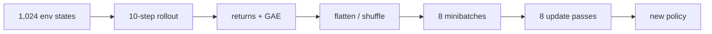

# 02E｜从 1,024 个世界到一次 Brax 更新

建议 60–90 分钟。前置：02A–02D。

## 先追 shape，不先追每行实现

视觉 full 配置的关键量包括 `num_envs=1024`、`unroll_length=10`、
`num_minibatches=8`、`num_updates_per_batch=8`。概念上的 rollout 首先具有
`[time, env, ...]`：10 个时间步 × 1,024 个并行世界。每个 observation 还包含
图像 `[64,64,3]`，action 末维为 3。

收集后，time/env 常展平为 10,240 个 transition，再切成 8 个 minibatch，每份
约 1,280 个样本。具体库还可能跨 devices、epochs 或 batch 重新排列，所以应通过
配置和调试输出验证，不能把概念 shape 当成所有内部数组的永久顺序。

## 一次训练 epoch 的数据流

同一 rollout 被多轮 minibatch update 使用是 PPO 提高数据效率的方式，但使用
次数有限；下一批必须由更新后的 on-policy 策略重新采集。

## 训练步数容易混淆

日志 `steps` 通常累计环境 transition，而不是 optimizer step、control step 的墙钟
时间，也不是单个 episode 数。并行环境越多，每个批次增加的 global environment
steps 越多。对比实验时必须固定“总 environment steps”，并记录并行 profile；仅
固定 wall time 或 epoch 数不一定等计算量。

## 显存为何在更新时爆炸

环境状态和渲染 buffer 已占显存，CNN forward/backward 还要保留 activation；PPO
shuffle/minibatch 与 XLA 中间 buffer 会产生峰值。第一次 eval 成功不代表第一轮
gradient update 也能容纳。2080 Ti 的 full profile 因此从官方 1024 并行度降低到
适配 11 GiB 的配置，同时保持总 timestep 预算并在 manifest 中披露差异。

## 暂停并计算

1. 10×1024 有多少 transition？
2. 理想均分 8 minibatch 后每份多少？
3. `num_updates_per_batch=8` 是否产生 8 倍新的环境数据？

答案：10,240；1,280；否，它多次更新同一批 rollout。

## 通过标准

能画出 rollout→GAE→minibatch→update；能区分 environment step、optimizer update
与 episode；能解释 OOM 为何常在第一次训练更新而非 reset/eval 出现。
